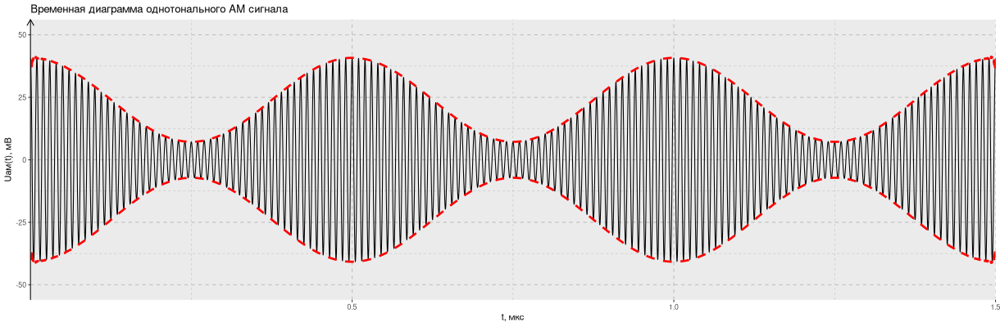
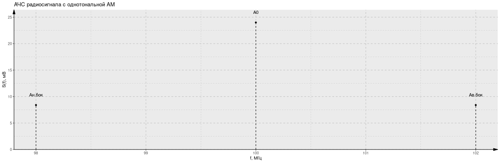

## Установка и запуск

Для начала следует клонировать репозиторий:

```bash
git clone https://github.com/olekzonder/signal-processing.git
```

Сборка осуществляется с помощью Docker (см. Dockerfile):

```bash
docker build . -t signal-processing
```
Программа занимает порт 8888:

```bash
docker run -p 8888:8888 signal-processing
```
## Задания

### Расчет АЧС АМ-сигнала

Программа имеет:

- Возможность задать амплитуду ($U_{0}$) и частоту ($f_{0}$) несущих колебаний;

- Возможность задать глубину модуляции $m_{1}$;

- Возможность задать частоту колебаний модулирующего сигнала $F_{m1}$;

На основе входных данных программа вычисляет:

- Амплитуду центральной гармоники $A_0$;

- Амплитуду верхней и нижней боковых гармоник $A_{в.бок}$, $A_{н.бок}$;

- Частоты нижней и верхней боковых гармоник $f_{н.бок}$, $f_{в.бок}$;

- Ширину спектра сигнала $\Delta f_{c}$.

Также программа строит графики:

- Временной диаграммы сигнала (есть возможность отобразить огибающую);

- АЧС сигнала.

#### Примеры графиков




